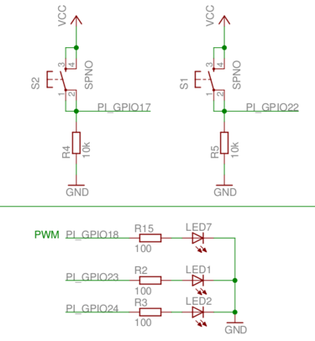

# gpio_rpi - Elixir Actor Library for Raspberry GPIO

[](https://travis-ci.org/Hermanverschooten/gpio_rpi)
[](https://hex.pm/packages/gpio_rpi)

This is a special edition of the GPIO part of the fantastic elixir_ale library maintained by Frank Hunleth.
It contains some additions that are only available on Raspberry Pi.

`gpio_rpi` provides high level abstractions for interfacing to GPIOs on Raspberry PI platforms.

`gpio_rpi` works great with LEDs, buttons, many kinds of sensors, and simple
control of motors. In general, if a device requires high speed transactions or
has hard real-time constraints in its interactions, this is not the right
library. For those devices, it is recommended to look at other driver options, such
as using a Linux kernel driver.

# Getting started

If you're natively compiling gpio_rpi, everything should work like any other
Elixir library. Normally, you would include gpio_rpi as a dependency in your
`mix.exs` like this:

    defp deps do
      [{:gpio_rpi, "~> 0.5.8"}]
    end

If you just want to try it out, you can do the following:

    git clone https://github.com/Hermanverschooten/gpio_rpi.git
    cd gpio_rpi
    mix compile
    iex -S mix

If you're cross-compiling, you'll need to setup your environment so that the
right C compiler is called. See the `Makefile` for the variables that will need
to be overridden. At a minimum, you will need to set `CROSSCOMPILE`,
`ERL_CFLAGS`, and `ERL_EI_LIBDIR`.

If you're trying to compile on a Raspberry Pi and you get errors indicated that Erlang headers are missing
(`ie.h`), you may need to install erlang with `apt-get install
erlang-dev` or build Erlang from source per instructions [here](http://elinux.org/Erlang).

# Examples

## GPIO

A GPIO is just a wire that you can use as an input or an output. It can only be
one of two values, 0 or 1. A 1 corresponds to a logic high voltage like 3.3 V
and a 0 corresponds to 0 V. The actual voltage depends on the hardware.

Here's an example setup:



To turn on the LED that's connected to the net labelled
`PI_GPIO18`, you can run the following:

    iex> {:ok, pid} = Gpio.start_link(18, :output)
    {:ok, #PID<0.96.0>}

    iex> Gpio.write(pid, 1)
    :ok

Input works similarly:

    iex> {:ok, pid} = Gpio.start_link(17, :input)
    {:ok, #PID<0.97.0>}

    iex> Gpio.read(pid)
    0

    # Push the button down

    iex> Gpio.read(pid)
    1

If you'd like to get a message when the button is pressed or released, call the
`set_int` function. You can trigger on the `:rising` edge, `:falling` edge or
`:both`.

    iex> Gpio.set_int(pid, :both)
    :ok

    iex> flush
    {:gpio_interrupt, 17, :rising}
    {:gpio_interrupt, 17, :falling}
    :ok

Note that after calling `set_int`, the calling process will receive an initial message with the state of the pin.
This prevents the race condition between getting the initial state of the pin and turning on interrupts. Without it, you could get the state of the pin, it could change states, and then you could start waiting on it for interrupts. If that happened, you would be out of sync.

## FAQ

### Where can I get help?

Most issues people have are on how to communicate with hardware for the first
time. Since `gpio_rpi` is a thin wrapper on the Linux sys class interface, you
may find help by searching for similar issues when using Python or C.

For help specifically with `gpio_rpi`, you may also find help on the
nerves channel on the [elixir-lang Slack](https://elixir-slackin.herokuapp.com/).
Many [Nerves](http://nerves-project.org) users also use `gpio_rpi`.

### Why isn't gpio_rpi a NIF?

While `gpio_rpi` should never crash, it's hard to guarantee that weird
conditions, wouldn't hang the Erlang VM. `gpio_rpi` errors on the side of safety of the VM.

### I tried turning on and off a GPIO as fast as I could. Why was it slow?

Please don't do that - there are so many better ways of addressing whatever
you're trying to do:

  1. If you're trying to drive a servo or dim an LED, look into PWM. Many
     platforms have PWM hardware and you won't tax your CPU at all. If your
     platform is missing a PWM, several chips are available that take I2C
     commands to drive a PWM output.
  2. If you need to implement a wire level protocol to talk to a device, look
     for a Linux kernel driver. It may just be a matter of loading the right
     kernel module.
  3. If you want a blinking LED to indicate status, `gpio_rpi` really should
     be fast enough to do that, but check out Linux's LED class interface. Linux
     can flash LEDs, trigger off events and more. See [nerves_leds](https://github.com/nerves-project/nerves_leds).

If you're still intent on optimizing GPIO access, you may be interested in
[gpio_twiddler](https://github.com/fhunleth/gpio_twiddler).

### Where's PWM support?

Somewhere in the future.

### Can I develop code that uses gpio_rpi on my laptop?

Yes, I provided a dummy library that should be code-compatible.
In your code, you can replace alias the dummy lib in dev

```elixir
defmodule SomeGpioUser do
  if Mix.env == :dev do
    alias DummyGpioRpi, as: GpioRpi
  end
  ...
```

### How do I debug?

The most common issue is getting connected to a part the first time. If you're
having trouble, check that the device files exist in `/sys/class/gpio`.

### Can I help maintain gpio_rpi?

Yes! If your life has been improved by `gpio_rpi` and you want to give back,
it would be great to have new energy put into this project. Please email me.

# License

This library draws much of its design and code from the elixir_ale project which
is licensed under the Apache License, Version 2.0. As such, it is licensed
similarly.
